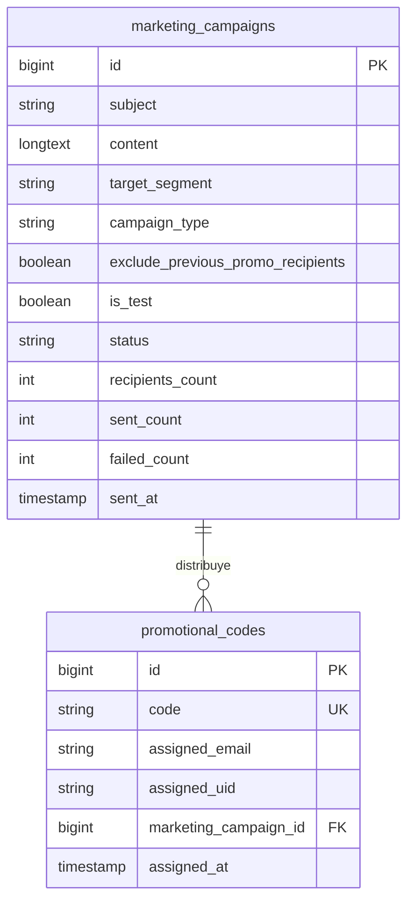

# Data Model: Distribución de Códigos Promocionales

**Feature**: `003-promo-code-campaigns` | **Date**: 2026-09-13

## 1. Tablas en Base de Datos Local (MySQL / SQLite)

### Nueva Tabla: `promotional_codes`

Almacena el inventario de códigos promocionales generados en Google Play Console y el registro de su asignación a los usuarios móviles.

| Columna | Tipo | Nulo | Por defecto | Descripción |
| :--- | :--- | :---: | :---: | :--- |
| `id` | `BIGINT UNSIGNED` | No | Auto-inc | Identificador único del registro |
| `code` | `VARCHAR(255)` | No | - | Código promocional alfanumérico único (índice único) |
| `assigned_email` | `VARCHAR(255)` | Sí | `NULL` | Correo del usuario receptor (índice para búsqueda rápida) |
| `assigned_uid` | `VARCHAR(255)` | Sí | `NULL` | Identificador único del usuario en Firebase Auth |
| `marketing_campaign_id`| `BIGINT UNSIGNED` | Sí | `NULL` | Campaña que distribuyó el código (`foreignId` nullable con `nullOnDelete`) |
| `assigned_at` | `TIMESTAMP` | Sí | `NULL` | Fecha y hora en la que se realizó la asignación |
| `created_at` | `TIMESTAMP` | Sí | `NULL` | Fecha de importación a la base de datos |
| `updated_at` | `TIMESTAMP` | Sí | `NULL` | Fecha de última actualización |

**Índices**:
- `unique(['code'])`: Garantiza unicidad absoluta contra duplicados en cargas masivas.
- `index(['assigned_email'])`: Acelera la verificación de si un usuario ya posee un código asignado.
- `index(['marketing_campaign_id'])`: Consultas por campaña.

---

### Modificación de Tabla Existente: `marketing_campaigns`

Nuevos atributos incorporados mediante migración para soportar la tipificación de campañas y reglas de exclusión.

| Columna | Tipo | Nulo | Por defecto | Descripción |
| :--- | :--- | :---: | :---: | :--- |
| `campaign_type` | `VARCHAR(50)` | No | `'standard'` | Tipo de campaña: `'standard'` o `'promotional_code'` |
| `exclude_previous_promo_recipients` | `BOOLEAN` | No | `true` | Si es `true`, excluye a usuarios que ya tienen código asignado |

---

## 2. Modelos Eloquent

### `App\Models\PromotionalCode`

- **Atributos Fillable**:
  - `code`
  - `assigned_email`
  - `assigned_uid`
  - `marketing_campaign_id`
  - `assigned_at`
- **Casts**:
  - `assigned_at` => `datetime`
- **Relaciones**:
  - `campaign(): BelongsTo<MarketingCampaign>`
- **Scopes**:
  - `scopeAvailable(Builder $query)`: Filtra registros donde `assigned_email IS NULL`.
  - `scopeAssigned(Builder $query)`: Filtra registros donde `assigned_email IS NOT NULL`.
- **Métodos Clave**:
  - `isAssigned(): bool`: Devuelve `true` si el código ya ha sido adjudicado.
  - `release(): void`: Restablece `assigned_email`, `assigned_uid`, `assigned_at` y `marketing_campaign_id` a `NULL` para devolver el código al inventario libre.

### `App\Models\MarketingCampaign` (Ampliaciones)

- **Constantes de Tipo**:
  - `const TYPE_STANDARD = 'standard';`
  - `const TYPE_PROMOTIONAL_CODE = 'promotional_code';`
- **Relaciones**:
  - `promotionalCodes(): HasMany<PromotionalCode>`
- **Métodos Helper**:
  - `isPromotionalCode(): bool`: Devuelve `true` si `campaign_type === self::TYPE_PROMOTIONAL_CODE`.

---

## 3. Entidades y DTOs en Memoria

### `App\Services\Marketing\CampaignRecipient` (Actualización)

```php
final readonly class CampaignRecipient
{
    public function __construct(
        public string $email,
        public string $name,
        public bool $isPremium,
        public ?string $uid = null,
    ) {}
}
```
Se añade la propiedad opcional `$uid` para propagar el ID de Firebase Auth desde Firestore hacia el job de despacho y la asignación del código.

---

## 4. Diagrama Entidad-Relación



