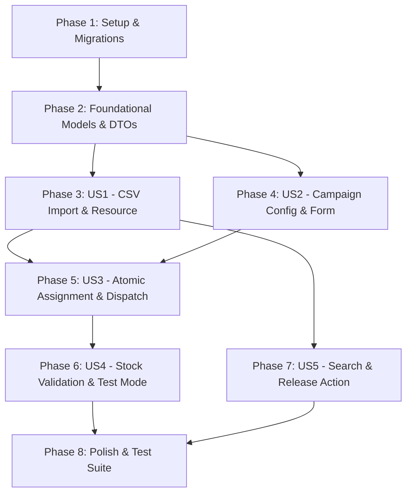

# Tasks: Distribución de Códigos Promocionales en Campañas de Marketing

**Input**: Design documents from `/specs/003-promo-code-campaigns/`

**Prerequisites**: `plan.md`, `spec.md`, `research.md`, `data-model.md`, `contracts/`, `quickstart.md`

**Organization**: Tareas organizadas por fases y por Historias de Usuario (US1 a US5) para permitir implementación y pruebas independientes.

## Format: `[ID] [P?] [Story] Description`
- **[P]**: Ejecutable en paralelo (archivos independientes, sin dependencias previas bloqueantes).
- **[Story]**: Historia de usuario a la que pertenece la tarea (US1, US2, US3, US4, US5).

---

## Phase 1: Setup (Shared Infrastructure)

**Purpose**: Crear migraciones de base de datos para el inventario de códigos y las extensiones de campañas, y actualizar DTOs compartidos.

- [x] T001 Crear la migración de base de datos para la tabla `promotional_codes` (`code`, `assigned_email`, `assigned_uid`, `marketing_campaign_id`, `assigned_at`) en `database/migrations/2026_09_13_000004_create_promotional_codes_table.php`
- [x] T002 [P] Crear la migración para añadir `campaign_type` y `exclude_previous_promo_recipients` a `marketing_campaigns` en `database/migrations/2026_09_13_000005_add_promo_code_fields_to_marketing_campaigns_table.php`
- [x] T003 Ejecutar las migraciones con `php artisan migrate` para aprovisionar las nuevas tablas y columnas en la base de datos
- [x] T004 [P] Actualizar el DTO `CampaignRecipient` para incluir la propiedad opcional `$uid = null` en `app/Services/Marketing/CampaignRecipient.php`

---

## Phase 2: Foundational (Blocking Prerequisites)

**Purpose**: Modelos Eloquent base, relaciones, constantes y factories requeridos por todas las historias de usuario.

**⚠️ CRITICAL**: No comenzar las fases de historias de usuario hasta completar esta fase fundacional.

- [x] T005 Implementar el modelo Eloquent `PromotionalCode` con fillable, casts, scopes (`available`, `assigned`), método `release()` y relación `campaign()` en `app/Models/PromotionalCode.php`
- [x] T006 [P] Crear el factory `PromotionalCodeFactory` para pruebas automatizadas en `database/factories/PromotionalCodeFactory.php`
- [x] T007 [P] Actualizar el modelo `MarketingCampaign` con constantes `TYPE_STANDARD`, `TYPE_PROMOTIONAL_CODE`, casts, relación `promotionalCodes()` y helper `isPromotionalCode()` en `app/Models/MarketingCampaign.php`
- [x] T008 [P] Crear prueba unitaria para el modelo `PromotionalCode` verificando scopes de disponibilidad, relación y método `release()` en `tests/Unit/Marketing/PromotionalCodeModelTest.php`

**Checkpoint**: Base de datos y modelos Eloquent listos para construir las historias de usuario.

---

## Phase 3: User Story 1 - Carga y Gestión del Inventario de Códigos Promocionales (Priority: P1) 🎯 MVP

**Goal**: Permitir al administrador subir archivos CSV de Google Play Console, procesar en streaming, ignorar duplicados e insertar los códigos en estado disponible.

**Independent Test**: Subir un archivo CSV con la cabecera `Promotion code` en Filament y comprobar que los códigos se insertan en la tabla local en estado disponible y que los duplicados son descartados.

### Tests for User Story 1

- [x] T009 [P] [US1] Crear prueba de Feature para la importación de archivos CSV de Google Play Console verificando normalización, omisión de cabecera y descarte de duplicados en `tests/Feature/Marketing/PromotionalCodeImportTest.php`

### Implementation for User Story 1

- [x] T010 [US1] Implementar la acción de importación masiva `importCsv` con procesamiento en streaming (`SplFileObject`), normalización de líneas e inserción por lotes con `insertOrIgnore` en `app/Filament/Resources/PromotionalCodes/Tables/PromotionalCodesTable.php`
- [x] T011 [US1] Crear la página de listado `ListPromotionalCodes` con la acción de cabecera en `app/Filament/Resources/PromotionalCodes/Pages/ListPromotionalCodes.php`
- [x] T012 [US1] Registrar el recurso Filament `PromotionalCodeResource` bajo el grupo de navegación "Marketing" en `app/Filament/Resources/PromotionalCodes/PromotionalCodeResource.php`

**Checkpoint**: Inventario de códigos promocionales cargable y visible en Filament (MVP de gestión de stock).

---

## Phase 4: User Story 2 - Configuración de Campañas de Tipo "Código Promocional" (Priority: P1)

**Goal**: Permitir al administrador seleccionar el tipo de campaña, visualizar el stock disponible de códigos, configurar la casilla de exclusión de usuarios previos y validar la presencia de la variable `{{promotioncode}}`.

**Independent Test**: Crear una campaña de tipo "Código Promocional" en Filament y verificar que muestra el indicador de stock, la casilla de exclusión por defecto activa y valida la inclusión de `{{promotioncode}}`.

### Tests for User Story 2

- [x] T013 [P] [US2] Crear prueba de Feature para la validación del formulario de campaña con tipo "Código Promocional" y presencia del comodín `{{promotioncode}}` en `tests/Feature/Marketing/MarketingCampaignFormTest.php`

### Implementation for User Story 2

- [x] T014 [US2] Actualizar el formulario `MarketingCampaignForm` para incluir el selector `campaign_type`, el indicador de stock de códigos libres disponibles, la casilla `exclude_previous_promo_recipients` y la validación obligatoria de `{{promotioncode}}` en `app/Filament/Resources/MarketingCampaigns/Schemas/MarketingCampaignForm.php`

**Checkpoint**: Campañas configurables con el tipo código promocional y validación de plantilla.

---

## Phase 5: User Story 3 - Asignación Atómica y Despacho Asíncrono de Códigos (Priority: P1)

**Goal**: En el job asíncrono `SendMarketingCampaignJob`, reservar de forma atómica y transaccional con `lockForUpdate()` un código libre por destinatario, sustituir `{{promotioncode}}` en texto plano y gestionar el reenvío del mismo código a usuarios no premium si la exclusión está inactiva.

**Independent Test**: Lanzar el job de despacho para una campaña de códigos y verificar que cada destinatario recibe un código único, que la variable `{{promotioncode}}` se reemplaza correctamente y que en la base de datos se guarda `assigned_email` y `assigned_uid`.

### Tests for User Story 3

- [x] T015 [P] [US3] Crear pruebas de Feature en `tests/Feature/Marketing/SendMarketingCampaignJobTest.php` que verifiquen la asignación atómica sin duplicados, el reemplazo de `{{promotioncode}}`, el reenvío del mismo código a destinatarios no premium cuando la casilla está inactiva y la omisión de usuarios que ya son premium
- [x] T016 [US3] Actualizar `SendMarketingCampaignJob` para incorporar la asignación atómica bajo demanda con transacción y `lockForUpdate()`, el reenvío de código existente a usuarios no premium si aplica, la sustitución de `{{promotioncode}}` y el registro de `assigned_email` y `assigned_uid` en `app/Jobs/SendMarketingCampaignJob.php`

**Checkpoint**: Despacho completo y asignación concurrente y segura de códigos en producción.

---

## Phase 6: User Story 4 - Validación Preventiva de Stock y Simulación en Pruebas (Priority: P2)

**Goal**: Alerta y bloqueo en el modal de confirmación si la audiencia calculada supera los códigos disponibles; en envíos con `is_test = true`, inyectar un código simulado sin tocar la base de datos de códigos reales.

**Independent Test**: Comprobar que una campaña con audiencia superior al stock bloquea el botón de envío en el modal de Filament; disparar un envío de prueba y verificar que llega un código simulado y el inventario real no decrece.

### Tests for User Story 4

- [x] T017 [P] [US4] Crear prueba de Feature para la advertencia y bloqueo por déficit de stock en el modal de envío y la inyección de código simulado en modo test en `tests/Feature/Marketing/PromoCampaignValidationTest.php`

### Implementation for User Story 4

- [x] T018 [US4] Actualizar la acción `send` en `MarketingCampaignsTable` para contrastar la audiencia neta frente al stock de códigos libres disponibles y advertir/bloquear el envío en caso de déficit en `app/Filament/Resources/MarketingCampaigns/Tables/MarketingCampaignsTable.php`
- [x] T019 [US4] Actualizar `SendMarketingCampaignJob` para generar e inyectar el código simulado `'PROMO-TEST-' . strtoupper(Str::random(8))` cuando `$campaign->is_test` sea verdadero sin consultar ni alterar `promotional_codes` en `app/Jobs/SendMarketingCampaignJob.php`

**Checkpoint**: Protección de stock en envíos masivos y simulación segura en modo de prueba.

---

## Phase 7: User Story 5 - Consulta, Soporte y Auditoría de Códigos Asignados (Priority: P2)

**Goal**: Permitir al administrador y soporte técnico buscar códigos por alfanumérico o por email asignado, filtrar por disponibilidad y liberar manualmente un código asignado para devolverlo al stock.

**Independent Test**: Buscar un email en la tabla de códigos de Filament, verificar sus metadatos y ejecutar la acción "Liberar código" comprobando que pasa a estar disponible nuevamente.

### Tests for User Story 5

- [x] T020 [P] [US5] Crear prueba de Feature para la búsqueda, filtrado y acción de liberación manual de códigos asignados en `tests/Feature/Marketing/PromotionalCodeManagementTest.php`

### Implementation for User Story 5

- [x] T021 [US5] Configurar en `PromotionalCodesTable` las columnas (`code`, estado badge, `assigned_email`, `assigned_uid`, campaña, fecha), filtros de estado, buscador rápido y la acción de registro `release` ("Liberar código") en `app/Filament/Resources/PromotionalCodes/Tables/PromotionalCodesTable.php`

**Checkpoint**: Herramienta de soporte y auditoría completamente funcional en Filament.

---

## Phase 8: Polish & Cross-Cutting Concerns

**Purpose**: Verificación final de estilo de código, ejecución completa de la suite de pruebas y limpieza.

- [x] T022 Ejecutar el formateador de código Laravel Pint (`vendor/bin/pint --dirty --format agent`) para asegurar el cumplimiento estricto del estándar de estilo
- [x] T023 Ejecutar la suite completa de pruebas de marketing (`php artisan test --filter=Marketing`) y verificar que todos los casos pasen satisfactoriamente

---

## Dependencies & Execution Order

### Parallel Execution Opportunities
- `T001` y `T002`: Las dos migraciones son independientes y pueden redactarse en paralelo.
- `T005`, `T006`, `T007` y `T008`: Redacción de modelos, factories y pruebas unitarias de modelos en paralelo.
- `T009`, `T013`, `T015`, `T017` y `T020`: Los tests de cada historia de usuario pueden escribirse antes o en paralelo a sus componentes.
- `US4` (Validación de stock) y `US5` (Auditoría y liberación) pueden desarrollarse de forma paralela tras completar `US1` y `US3`.

